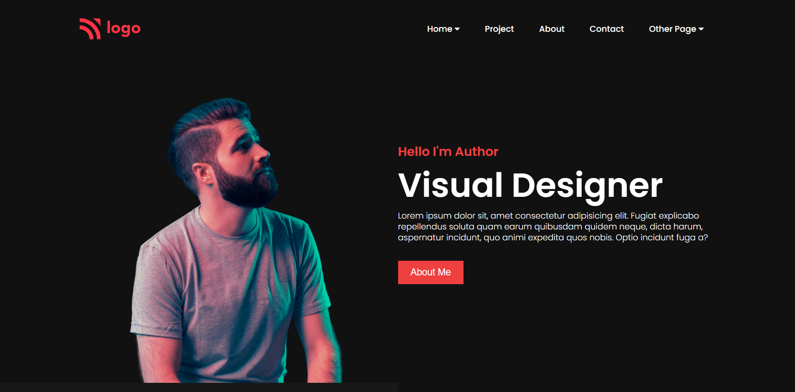

# Hi there 👋

I am Hirenkumar Trivedi. Passionate to become a Full Stack Web Developer.

## Project Name : **Visual designer Page !**

This is simple Visual designer Page, it is a part of Javascript web development bootcamp, Created this page with HTML and CSS.

 

# 💻 Tech Stack Used :

 

 

### My Project is looking like :

### You can Check it Live on Below Link :

[Deplyoed link!](https://liveclassproject15.netlify.app/)
